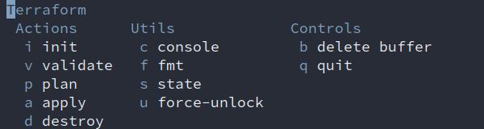
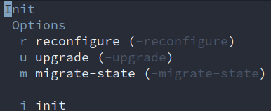

# magitf

Drawing inspiration from the greatest workflow `magit`, `magitf` is a terraform porcelain for emacs! Combining the magic workflow that emacs provides with the tedious ways to work with terraform-cli, running terraform inside of emacs with your other workflows is now a breeze.

## Installation

Should probably be configured to upload new releases to a package repository such as MELPA or some such for a more automated onboarding experience, but for now it'll have to be manual.

``` sh
export TOOLS_DIRECTORY="~/.emacs.d/modules/tools/magitf"
mkdir -p $TOOLS_DIRECTORY
curl -o $TOOLS_DIRECTORY/config.el https://github.com/fiskhest/magitf/blob/main/config.el 
```

Add magitf as a package to your emacs client
``` sh
# doom:
# ~/.doom/init.el
:tools
        magitf              ; a terraform porcelain for Emacs
```

If you prefer accessing magitf with `C-c t f`, add a global shortcut
``` sh
# doom:
# ~/.doom/config.el
(global-set-key (kbd "C-c t f") 'magitf-status)
```

## Usage

There are multiple ways of accessing the root transient menu:
- `SPC-g T`(erraform)
- `SPC-<localleader> t`(erraform)
- `C-c t f` (if you added the global shortcut manually)
- `M-x magitf-status`

When landing on the root transient menu, a selection for action, utility or control is necessary
Available actions:
- `init`
- `validate`
- `plan`
- `apply`
- `destroy`

Available utilities:
- `console`
- `fmt`
- `state`
- `force-unlock`

Sample screenshot to showcase the workflow:



## Whats next

Break up the results of `tf plan` (both in `action:(plan|apply|destroy)` so that each resource presented in the plan stdout can be broken down into a collapseable block for smoother overview, much like how magit handles staged and unstaged changes per file.
